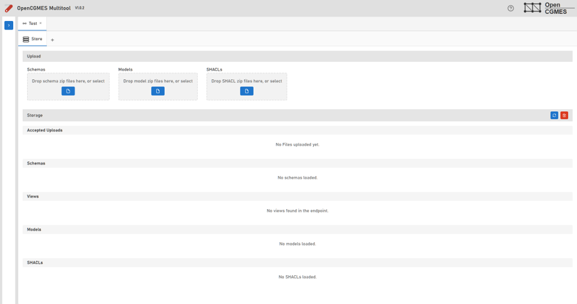
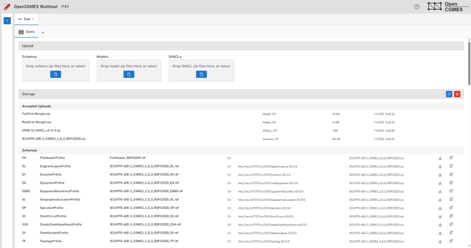
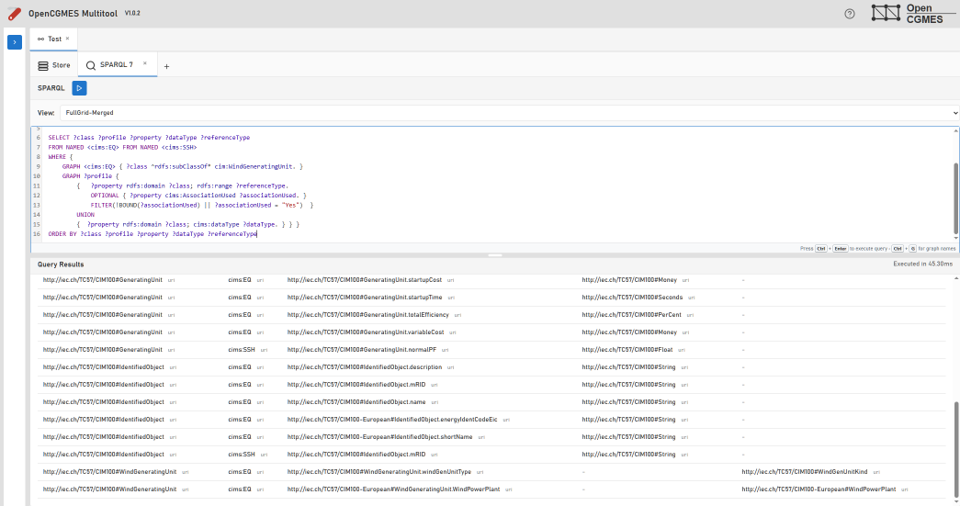
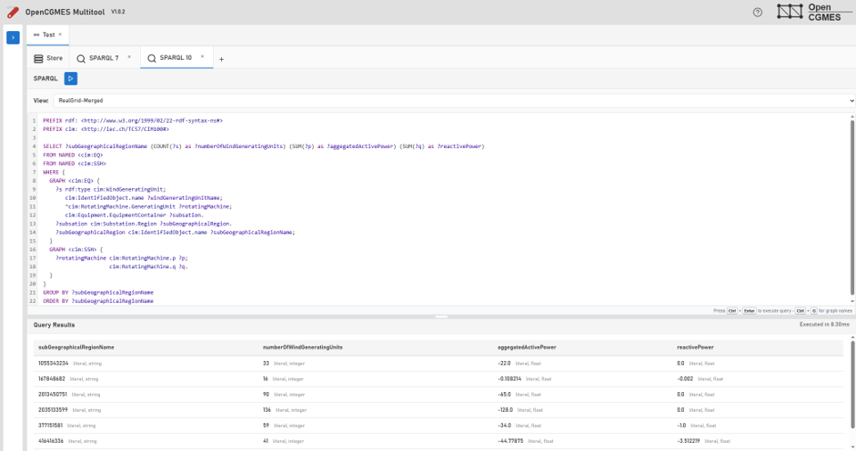
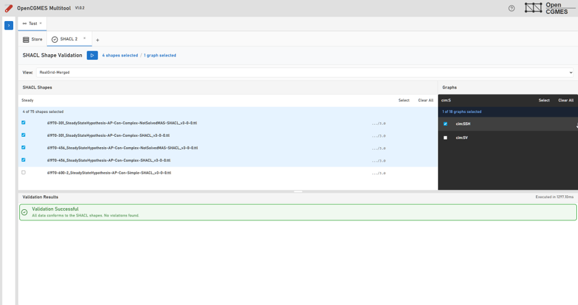
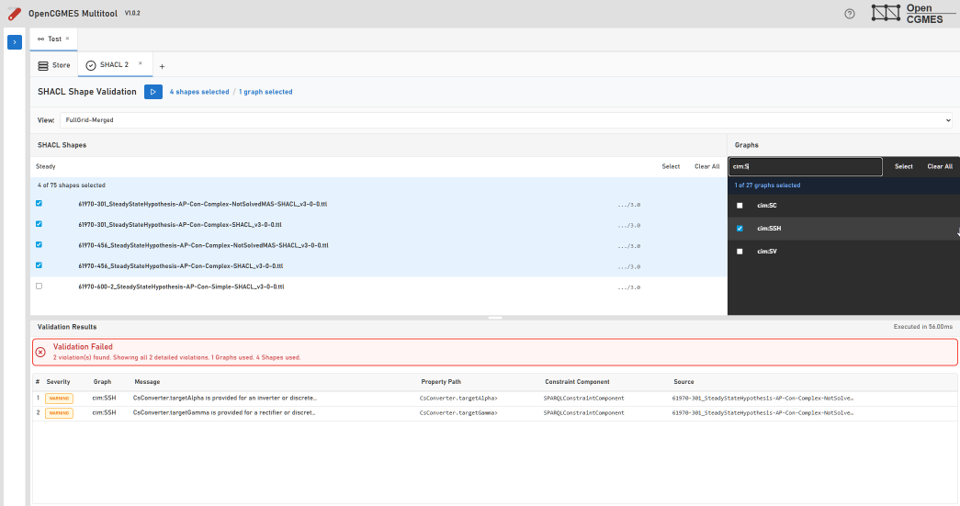

# QueryAndValidation UI
The QueryAndValidation UI is a web application that allows users to:
- Upload RDF Schema, SHACL shapes, and CIM XML files
- Query the uploaded data using SPARQL
- Validate the data against SHACL shapes

The Apache Jena framework and the OpenCGMES.CimXmlParser are used to provide robust functionality for handling CIM data.

The fist release is planned for end of 2025.

## Screenshots of the current state
Empty store without any uploaded files:

Filled store with uploaded files:

SPARQL query editor - querying RDF Schema for class properties:

SPARQL query editor - querying CIM XML data for aggregated wind power generation:

SHACL validation - example for a scuccessful validation:

SHACL validation - example for a failed validation:

## Data Sources and Acknowledgments

The data shown in the screenshots is derived from:

**CGMES Conformity Assessment Scheme Test Configurations v3.0.3**  
*ENTSO-E (European Network of Transmission System Operators for Electricity)*

This work is licensed under a [Creative Commons Attribution-NonCommercial-ShareAlike 4.0 International License][cc-by-nc-sa].

- **Source:** https://www.entsoe.eu/data/cim/cim-conformity-and-interoperability/
- **Usage:** Screenshots and configuration examples for demonstration purposes
- **License Compliance:** Non-commercial use with attribution as required

[cc-by-nc-sa]: http://creativecommons.org/licenses/by-nc-sa/4.0/