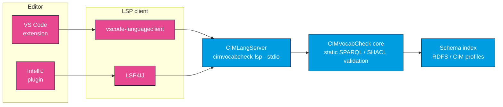

# CIMNotebook

CIMNotebook brings CIMVocabCheck's static SPARQL and SHACL validation into your editor as you
type. It ships as two thin clients — a **VS Code** extension and an **IntelliJ** plugin — that
both front the same language server, **CIMLangServer** (`cimvocabcheck-lsp`). Write a query or a
SHACL shape and unknown classes and properties are underlined, syntax errors are highlighted, and
semantic issues like domain/range mismatches are flagged immediately, all resolved against your
actual RDFS / CIM profile files.

## How it fits together

Both editors are deliberately thin: they own only the file-type registration, the syntax
highlighting, and a few settings. Every diagnostic, hover, completion, and definition jump comes
from CIMLangServer, which wraps the CIMVocabCheck core validation engine and its schema index.

The editor launches CIMLangServer as a Java process and talks to it over stdio using the Language
Server Protocol. The server builds a schema index from your CGMES / RDFS profiles and answers every
language request against it. Because the heavy lifting lives in one shared server, the two editors
report the **same diagnostics** for the same file and the same schema.

For the language server itself — its protocol surface, how it is launched, and how it resolves
configuration — see [CIMLangServer](/cimvocabcheck/language-server).

## What you get

Both editors share this feature set:

- **Syntax highlighting** for SPARQL (`.rq`, `.sparql`) and SHACL / Turtle (`.ttl`, `.shacl`).
- **Real-time diagnostics** — unknown classes and properties, syntax errors, and semantic findings
  such as domain/range mismatches and invalid SHACL cardinalities. See the full
  [diagnostic-code table](/cimvocabcheck/validation-checks).
- **Hover documentation** — the IRI, `rdfs:label`, `rdfs:comment`, domain/range, and source
  profile for any CIM term.
- **Auto-completion** — class and property suggestions after a prefix such as `cim:`.
- **Go-to-definition** — jump to a term's declaration line in the source profile file.
- **Workspace symbol search** — find any schema term by partial, case-insensitive name.

:::note Per-editor feature parity
The VS Code extension is currently ahead of the IntelliJ plugin in a few places (notably
endpoint-aware hover and go-to-definition, and SPARQL Notebook cell validation). Each editor page
documents what that editor actually does today.
:::

## Schema configuration

CIMNotebook has **no bundled default schema** — point it at your CGMES profiles with an
`opencgmes.json` file (settings nest under a `"cimvocabcheck"` section, discovered by walking up
from each file). Without a schema, validation is syntax-only. The full format is documented once,
canonically, on the [Configuration](/cimvocabcheck/configuration) page.

## Pick your editor

- **[VS Code](/cimnotebook/vscode)** — install the VSIX, configure a schema, and validate `.rq`,
  `.sparql`, `.ttl`, `.shacl` files plus [SPARQL Notebook cells](/cimnotebook/sparql-notebooks).
- **[IntelliJ](/cimnotebook/intellij)** — install the plugin (and LSP4IJ) and validate the same
  file types inside any IntelliJ-platform IDE.

Hitting a problem? See [Troubleshooting](/cimnotebook/troubleshooting).
