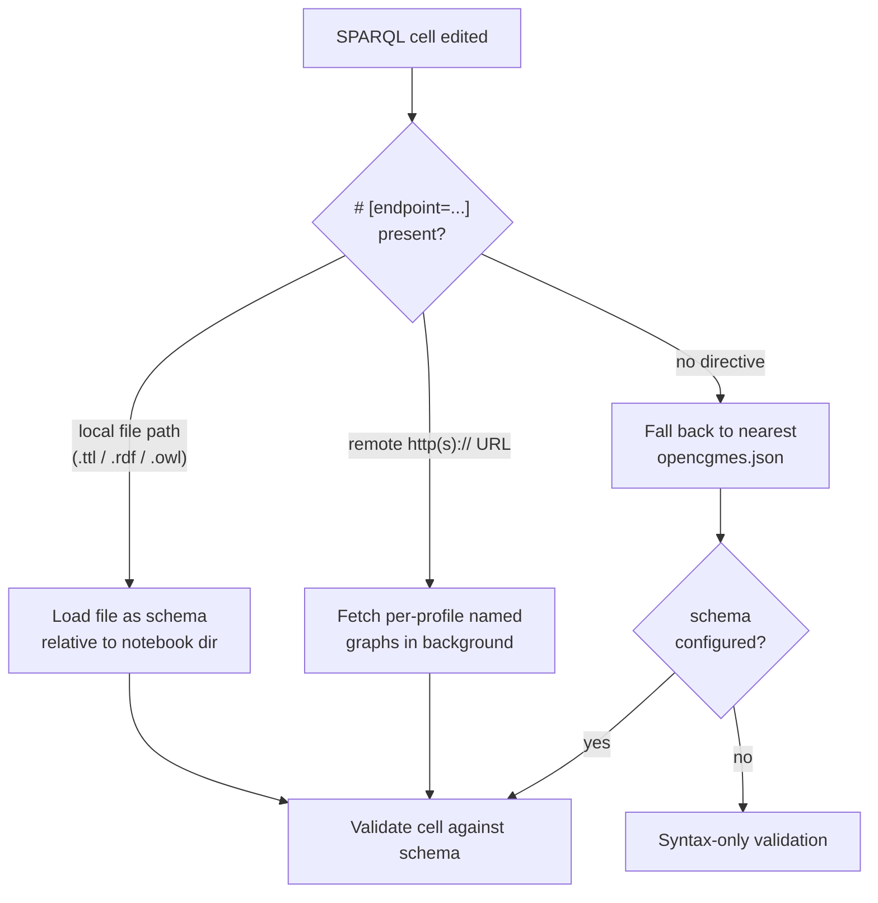

# SPARQL Notebooks

In VS Code, CIMNotebook validates SPARQL **cells** inside
[SPARQL Notebook](https://marketplace.visualstudio.com/items?itemName=Zazuko.sparql-notebook)
documents, not just `.rq` / `.sparql` files. Each cell is validated independently as you edit it,
and a cell can name the schema it should be checked against with the SPARQL Notebook endpoint
directive.

:::note VS Code only
SPARQL Notebook cell validation is a VS Code feature. The [IntelliJ plugin](/cimnotebook/intellij)
validates `.rq`, `.sparql`, `.ttl`, and `.shacl` files but does not validate notebook cells.
:::

## Per-cell validation

Open a SPARQL Notebook and each SPARQL cell is forwarded to CIMLangServer as its own document. You
get the same diagnostics, hover, and completion you would in a standalone `.rq` file — scoped to
that one cell.


{/* TODO image: a SPARQL Notebook cell with an endpoint directive on line 1 and an underlined UNKNOWN_PROPERTY below */}

## The `# [endpoint=...]` directive

A cell can point at the schema to validate against with a SPARQL Notebook endpoint directive on its
first line:

```sparql
# [endpoint=./schemas/cgmes-3.0/EquipmentCore.ttl]
SELECT * WHERE { ?s a cim:ACLineSegment }
```

The directive names **where the CGMES schema lives** — never live instance data. There are three
cases:

- **Local file** (`./relative/path.ttl`, `.rdf`, `.owl`) — the file is loaded as the schema for
  that cell. Relative paths resolve against the notebook's own directory.
- **Remote SPARQL endpoint** (`http(s)://…`) — CIMNotebook loads the schema from the endpoint
  itself, enumerating the named graphs that hold the CGMES profiles and reading them into the schema
  index. The schema is fetched in the background; diagnostics appear once it has loaded.
- **No directive** — the cell falls back to the workspace schema (the nearest `opencgmes.json`),
  exactly like a `.rq` file; with no schema configured, it is checked syntax-only.

A remote endpoint is typically an Apache Jena Fuseki server with the RDFS profiles loaded in
**per-profile named graphs**. CIMNotebook validates against that schema and never queries live
instance data. For how the server connects to and reads a remote endpoint, see
[Endpoints](/cimvocabcheck/endpoints).

## How a cell resolves its schema



## Known limitations

:::warning Remote schema layout
Loading a schema from a remote SPARQL endpoint assumes the CGMES profiles are stored in
**per-profile named graphs** (graphs that declare `rdfs:Class` / `owl:Ontology`); instance-data
graphs are skipped. Endpoints that store the whole schema in the default graph, or mix it with
instance data in one graph, are not supported.
:::

:::note Session caching
A schema loaded from an endpoint is cached for the session. To re-fetch it, edit `opencgmes.json`
(which triggers a reload) or reload the window. Diagnostics, hover, auto-completion, and
go-to-definition are all endpoint-aware; because there is no local file, go-to-definition on an
endpoint term opens a generated read-only Turtle "peek" of the term fetched from the endpoint.
:::
