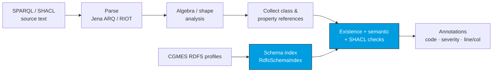
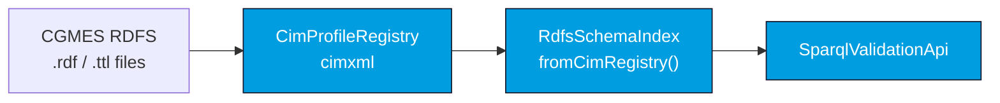
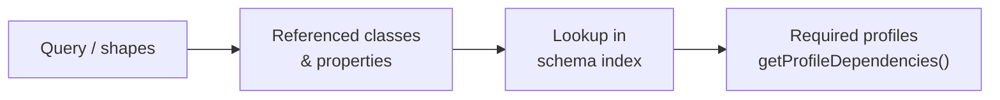

# Architecture

CIMVocabCheck turns a SPARQL query or SHACL shapes graph into a list of diagnostics by comparing
the **terms it references** against a **schema index** built from CGMES / RDFS profiles. It never
executes the query and never touches RDF instance data.

## Validation pipeline

1. **Parse** — the SPARQL is parsed with Jena ARQ (query *or* update is auto-detected); SHACL is
   read as an RDF graph with RIOT.
2. **Analyze** — a visitor walks the SPARQL algebra (or the SHACL shapes) and collects every class
   and property IRI, the graph context, and the subject types in scope.
3. **Look up** — each reference is checked against the `RdfsSchemaIndex`: does it exist, in which
   profiles, with what `rdfs:domain` / `rdfs:range` / `rdfs:subClassOf`.
4. **Emit** — findings become [`SparqlValidationAnnotation`](/cimvocabcheck/api) records with a
   stable [code](/cimvocabcheck/validation-checks), severity, and source position.

## The schema index

The schema index (`RdfsSchemaIndex`) is the heart of the engine. It is built from CGMES RDFS
profiles — most conveniently from the [CIMXML](/cimxml/overview) profile registry, which already
parses CIM profiles and resolves their datatypes:

Each profile is keyed by its `owl:versionIRI` (CGMES 3.0) or its `cims:isFixed` version IRIs
(CGMES 2.4.15). A query can be validated against **all** profiles, a **subset**, or **per-graph**
profile scopes — see [profile scope on the API page](/cimvocabcheck/api#profile-scope).

## Profile dependencies

CIMVocabCheck can also answer the inverse question — *which profiles does this query actually
need?* — by resolving each referenced term back to the profiles that declare it:

This powers `getProfileDependencies`, `getClassDependencies`, `getPropertyDependencies`, and
`getGraphDependencies` (see the [API reference](/cimvocabcheck/api#dependency-extraction)).

## How it ships

The engine lives in `cimvocabcheck-core` and is wrapped by three front-ends that all share the same
core and the same [configuration](/cimvocabcheck/configuration):

- [CLI](/cimvocabcheck/cli) — `cimvocabcheck-cli`, for CI.
- [CIMLangServer](/cimvocabcheck/language-server) — `cimvocabcheck-lsp`, an LSP 3.17 server.
- [CIMNotebook](/cimnotebook/overview) — VS Code & IntelliJ, fronting the language server.
