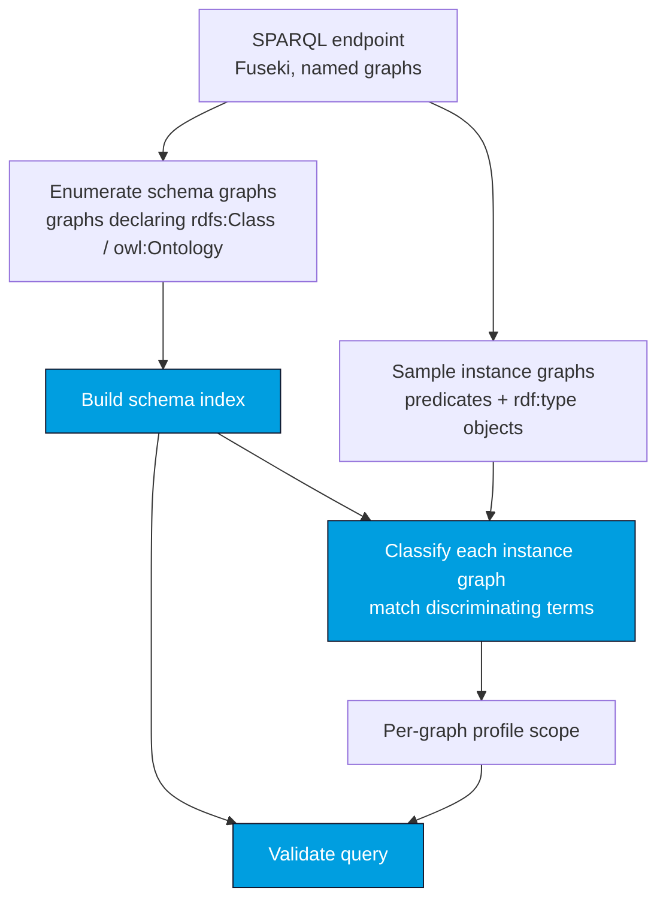

# Loading the Schema from a SPARQL Endpoint

When a SPARQL 1.1 endpoint (e.g. [Apache Jena Fuseki](https://jena.apache.org/documentation/fuseki2/))
hosts the CGMES RDFS schema **as named graphs**, CIMVocabCheck can discover the schema — and the
per-graph profile scope — automatically. No [`namedGraphs`](/cimvocabcheck/configuration#namedgraphs)
config required.

:::note The endpoint is a schema source, not a validation target
The endpoint names *where the schema lives*. CIMVocabCheck reads the RDFS profiles from it; it
never validates live instance data and never executes your query against it.
:::

## How it works



`EndpointSchemaLoader`:

1. **enumerates the schema graphs** — those declaring an `rdfs:Class` / `owl:Ontology` — and builds
   the index from them;
2. **classifies every other (instance) graph** by sampling its predicates and `rdf:type` objects
   and matching them against the schema, preferring *discriminating* terms declared by exactly one
   profile. A graph that uses an EQ-only property is mapped to EQ.

Classification only ever **samples** a graph to decide which profile it is — it never validates the
instance data.

## From Java

```java
import de.soptim.opencgmes.cimvocabcheck.core.schema.EndpointSchema;
import de.soptim.opencgmes.cimvocabcheck.core.schema.EndpointSchemaLoader;
import de.soptim.opencgmes.cimvocabcheck.core.SparqlValidationApi;
import de.soptim.opencgmes.cimvocabcheck.core.SparqlValidationResult;
import java.time.Duration;

EndpointSchema es = EndpointSchemaLoader.loadFromEndpoint(
        "http://localhost:3030/cgmes/query", Duration.ofSeconds(30));

if (!es.hasSchema()) {
    // Reachable, but no CIM schema graphs found — warn and fall back to syntax-only.
    SparqlValidationResult r = SparqlValidationApi.checkSyntaxOnly(queryText);
} else {
    SparqlValidationApi api = new SparqlValidationApi(es.index());
    // es.namedGraphScope() maps each instance graph to its detected profile(s):
    SparqlValidationResult r = api.validateSparql(queryText, es.namedGraphScope());
    // es.unmatchedGraphs() lists instance graphs that matched no known profile.
}
```

A Fuseki `…/update` URL is tolerated (its `…/query` sibling is used automatically). For in-process
datasets or tests, pass a `SparqlGraphSource` to `EndpointSchemaLoader.load(...)` instead.

## From the CLI

```bash
java -jar cimvocabcheck-cli.jar \
    --endpoint http://localhost:3030/cgmes/query path/to/query.rq
```

If the endpoint exposes no CIM schema graphs, validation falls back to a **syntax-only** check with
a warning. Pass `--strict-endpoint` to make that case a hard failure (exit 2) instead — so a
misconfigured pipeline breaks visibly rather than silently checking only syntax. See the
[CLI page](/cimvocabcheck/cli).

## From a SPARQL Notebook cell

In [CIMNotebook](/cimnotebook/sparql-notebooks), a notebook cell can name its schema endpoint
inline:

```sparql
# [endpoint=http://localhost:3030/cgmes/query]
SELECT * WHERE { ?s a cim:ACLineSegment }
```

## Assumptions & limitations

- The CGMES profiles must be stored in **per-profile named graphs** (graphs declaring
  `rdfs:Class` / `owl:Ontology`). A schema kept entirely in the default graph, or mixed with
  instance data in one graph, is not discovered.
- A profile graph that declares **neither** an `rdfs:Class` nor an `owl:Ontology` (rare — e.g. some
  header/boundary profiles) is not picked up by the enumeration filter.

See [Known limitations](/cimvocabcheck/limitations) for the broader picture.
