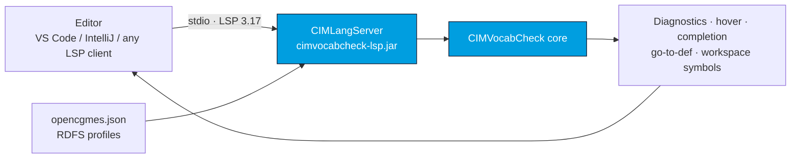

# CIMLangServer (Language Server)

`cimvocabcheck-lsp` — branded **CIMLangServer** — is a standalone
[LSP 3.17](https://microsoft.github.io/language-server-protocol/) server that wraps the
[`cimvocabcheck-core`](/cimvocabcheck/api) engine. It communicates over `stdio` and can be
integrated into any LSP-capable editor. The [CIMNotebook](/cimnotebook/overview) VS Code extension
and IntelliJ plugin are thin clients around it.

## How it fits



## Capabilities

The server provides, for `.rq` / `.sparql` (SPARQL) and `.ttl` / `.shacl` (SHACL/Turtle) documents:

- **Diagnostics** — the full [validation check set](/cimvocabcheck/validation-checks), debounced and
  re-run on change.
- **Hover** — IRI, label, comment, domain/range, and declaring profile for any CIM term.
- **Completion** — CIM-aware suggestions after a declared prefix (`cim:`, `rdf:`, …).
- **Go-to-definition** — jump to a term's declaration in the source RDFS file.
- **Workspace symbols** — find any schema class/property by (partial, case-insensitive) name.
- **Commands** — `cimvocabcheck.explainQuery` ([explain](/cimvocabcheck/explain-query)) and
  `cimvocabcheck.createConfig` (generate [`opencgmes.json`](/cimvocabcheck/configuration)).

## Configuration discovery

The server discovers the nearest `opencgmes.json` (walking up from each document), loads the
configured RDFS profiles, and **reloads** them whenever an `opencgmes.json` changes — all open
documents are revalidated after a reload. When no config is found, or it declares no schemas,
documents are validated **syntax-only** (there is no bundled default schema). See
[Configuration](/cimvocabcheck/configuration).

## Build

```bash
mvn -pl cimvocabcheck/lsp package -DskipTests
# Output: cimvocabcheck/lsp/target/cimvocabcheck-lsp.jar
```

## Run

```bash
java -jar cimvocabcheck/lsp/target/cimvocabcheck-lsp.jar
# Speaks LSP over stdin/stdout.
```

Launch it directly only for integration testing — normally an editor client starts it. Requires
**Java 21+**.

## Integrating another editor

Any LSP client can drive CIMLangServer. Point it at the launch command above, associate the
SPARQL/SHACL file types, and (optionally) wire the two `executeCommand` ids. For a worked example of
a client, see how [CIMNotebook](/cimnotebook/overview) does it for VS Code and IntelliJ.

:::note Command id vs. UI id
The wire-level `executeCommand` ids are always `cimvocabcheck.*` (e.g. `cimvocabcheck.explainQuery`),
even though the editors expose their own `cimnotebook.*` UI command ids. When integrating a new
client, send the `cimvocabcheck.*` ids to the server.
:::
