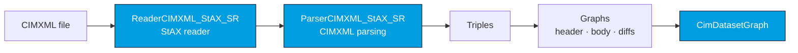
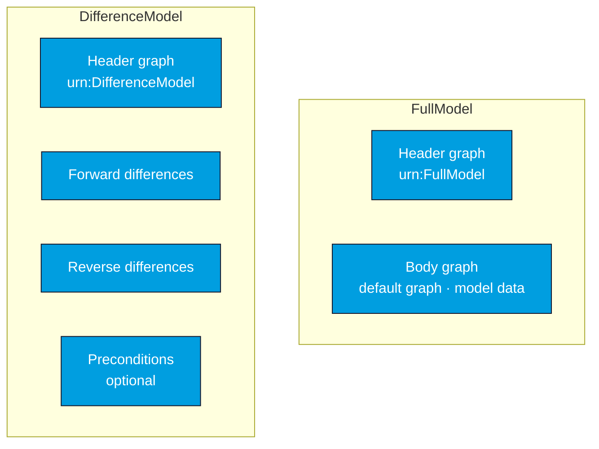

# Architecture

CIMXML is organized around a streaming parser that turns a CIMXML document into triples, a set of
CIM-aware graph structures, and a `CimDatasetGraph` that exposes the model's logical structure. This
page describes the core components, the parse pipeline, and the data model the library produces.

## Core components

### 1. Parser (`de.soptim.opencgmes.cimxml.parser`)

- **`CimXmlParser`** — the main entry point. Its `parseCimModel(...)` overloads accept a `Path`,
  `InputStream`, or `Reader`, and `parseAndRegisterCimProfile(Path)` loads profile ontologies into
  the parser's registry.
- **`ReaderCIMXML_StAX_SR`** — the StAX-based XML reader implementation.
- **`ParserCIMXML_StAX_SR`** — the core parsing logic with CIMXML-specific handling (CIM version
  detection, UUID normalization, profile-driven datatype resolution, and the IEC 61970-552
  processing instruction).

### 2. Graph structures (`de.soptim.opencgmes.cimxml.graph`)

- **`CimProfile`** — represents a CIM profile ontology (versions 16, 17, 18).
- **`CimModelHeader`** — a wrapper exposing model header information (`getModel`, `getProfiles`,
  `getSupersedes`, `getDependentOn`).
- **`FastDeltaGraph`** — an efficient delta graph used when applying difference models.
- **`DisjointMultiUnion`** — a union graph without duplicate elimination, used to combine header and
  body into a single graph.

### 3. Dataset (`de.soptim.opencgmes.cimxml.sparql.core`)

- **`CimDatasetGraph`** — an extended Jena `DatasetGraph` with CIM-specific operations
  (`isFullModel`, `getBody`, `getForwardDifferences`, `differenceModelToFullModel`, and so on).
- **`LinkedCimDatasetGraph`** — the implementation supporting the multiple named graphs that make up
  a CIM model.

### 4. Profile registry (`de.soptim.opencgmes.cimxml.rdfs`)

- **`CimProfileRegistry`** — the interface for registering and querying CIM profiles and resolving
  property datatypes.
- **`CimProfileRegistryStd`** — the standard implementation with caching. See
  [Profiles & datatypes](/cimxml/profiles-and-datatypes).

## Parse pipeline

A CIMXML file is read by the StAX reader, parsed into triples by the CIMXML parser, routed into the
appropriate graphs, and assembled into a `CimDatasetGraph`:

Datatype resolution happens during parsing using the profiles registered on the parser, and CIM
UUIDs are normalized to canonical `urn:uuid:` IRIs as triples are produced.

## Data model

The library organizes a CIMXML document into distinct graphs depending on whether it is a full model
or a difference model:

**FullModel** — the header graph carries metadata (model IRI, profiles, supersedes, dependentOn) and
the body is the default graph holding the actual model data. `fullModelToSingleGraph()` combines the
two into a single `DisjointMultiUnion` graph when you need a flat view.

**DifferenceModel** — the header graph carries metadata, and the forward, reverse, and (optional)
preconditions containers each become their own graph. Applying the model with
`differenceModelToFullModel(...)` yields a body graph (see [Difference models](/cimxml/difference-models)).

:::note Reaching the header
The header lives in its own named graph (`urn:FullModel` / `urn:DifferenceModel`), but you normally
reach it through `getModelHeader()` rather than by graph name.
:::
