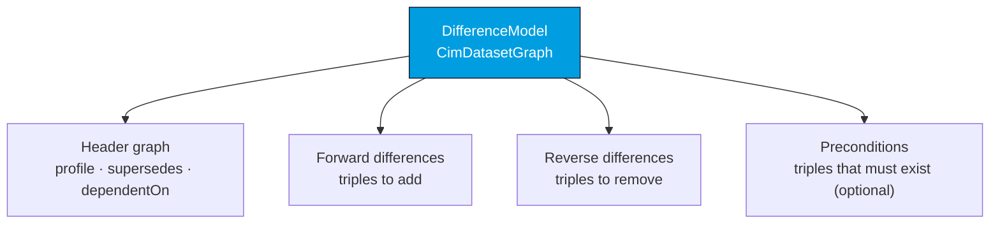
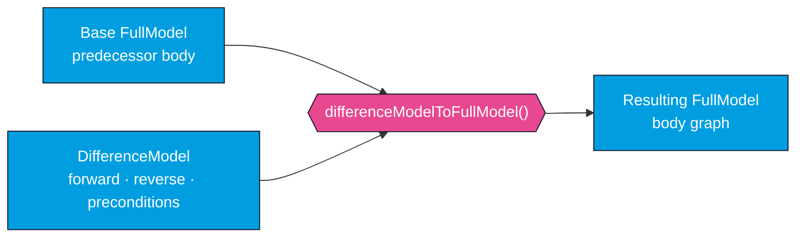

# Difference Models

A **difference model** (IEC 61970-552) describes incremental changes to a base full model rather
than a complete snapshot. It carries triples to add (forward differences), triples to remove
(reverse differences), and optional preconditions that must already hold in the base model.
CIMXML parses difference models into the same [`CimDatasetGraph`](/cimxml/architecture) type as full
models and can apply them to produce a resulting full-model graph.

## Structure

When CIMXML parses a `DifferenceModel`, it splits the document into distinct named graphs — a
header plus the three difference containers (the `dm:forwardDifferences`, `dm:reverseDifferences`,
and `dm:preconditions` containers, each using `rdf:parseType="Statements"`):



Access each container through the difference-model methods on `CimDatasetGraph`:

```java
if (diffModel.isDifferenceModel()) {
    Graph forwardDiffs   = diffModel.getForwardDifferences();
    Graph reverseDiffs   = diffModel.getReverseDifferences();
    Graph preconditions  = diffModel.getPreconditions();
}
```

Each accessor throws `IllegalStateException` if the dataset is not a difference model, so guard with
`isDifferenceModel()` first.

## Applying a difference model

`differenceModelToFullModel(predecessorFullModel)` applies the differences to a base full model and
returns the resulting graph:



```java
CimDatasetGraph baseModel = parser.parseCimModel(Path.of("base.xml"));
CimDatasetGraph diffModel = parser.parseCimModel(Path.of("difference.xml"));

Graph result = diffModel.differenceModelToFullModel(baseModel);
```

The result is a `FastDeltaGraph` over the base body — the differences are applied as a delta rather
than materialized into a new graph, which keeps large applications cheap (see
[Performance](/cimxml/performance)).

## Validation during application

Applying a difference model is checked, not blind. `differenceModelToFullModel` enforces:

- The receiver must be a difference model, and `predecessorFullModel` must be a full model —
  otherwise `IllegalStateException` / `IllegalArgumentException`.
- The predecessor's `Model` must be referenced in this model's `Model.Supersedes`.
- Every triple in the **preconditions** graph must already be present in the predecessor body;
  any missing precondition triples cause an `IllegalArgumentException` listing them.

:::note Forward + reverse = update
An update is expressed as a removal in the reverse differences plus an addition in the forward
differences for the same property. Reverse differences remove old triples; forward differences add
new ones. Preconditions let a producer assert the state it assumes before the change is applied.
:::

For the full end-to-end example with a base model, a difference model, and assertions on the
result, see the `differenceModelToFullModel` test referenced in [Library usage](/cimxml/library-usage).
