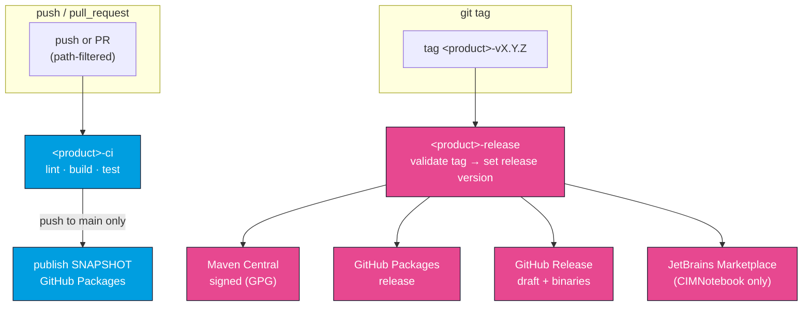

# CI & Releases

OpenCGMES ships its three products on **three independent CI/release trains**. Each product has its own `-ci` workflow (build, test, lint, publish SNAPSHOTs) and its own `-release` workflow (signed artifacts, triggered by a tag), so a change to one product never forces a release of another. This page describes the trains, the versioning scripts that feed them, and the supply-chain gates. See [Building](/developer-guide/building) for the underlying build commands.

## The six workflows at a glance

| Product | CI workflow | Release workflow | Release tag | Released artifacts |
| --- | --- | --- | --- | --- |
| **CIMXML** | `cimxml-ci.yml` | `cimxml-release.yml` | `cimxml-vX.Y.Z` | Maven Central + GitHub Packages JAR; GitHub Release (draft) |
| **CIMVocabCheck** | `cimvocabcheck-ci.yml` | `cimvocabcheck-release.yml` | `cimvocabcheck-vX.Y.Z` | `cimvocabcheck-core` to Maven Central + GitHub Packages; core/cli/lsp JARs on the GitHub Release |
| **CIMNotebook** | `cimnotebook-ci.yml` | `cimnotebook-release.yml` | `cimnotebook-vX.Y.Z` | VSIX + IntelliJ zip on the GitHub Release; plugin to JetBrains Marketplace |

Each CI workflow is scoped by path filters, so it only runs when files it owns change (CIMVocabCheck and CIMNotebook CI also trigger on `cimxml/**` and the shared scripts, because they build against CIMXML).

## How the trains flow

## CI trains (push / pull request)

### CIMXML CI (`cimxml-ci.yml`)
- **build-test** — `mvn -f cimxml/pom.xml clean verify` on Java 21.
- **publish-snapshot** — on push to `main`, computes the snapshot version and deploys the `-SNAPSHOT` JAR to **GitHub Packages**.

### CIMVocabCheck CI (`cimvocabcheck-ci.yml`)
- **lint** — compiler-warnings-as-errors, then Spotless/Checkstyle/SpotBugs/PMD (no tests, for fast feedback).
- **build-test** — checks out **submodules recursively** and runs `mvn -pl cimvocabcheck/core,cimvocabcheck/cli,cimvocabcheck/lsp -am clean verify` (which also builds cimxml). This is the authoritative run, including the ENTSO-E integration tests and coverage gates.
- **sbom** — regenerates the Maven SBOM and enforces the license allow-list + drift check (see below).
- **publish-snapshot** — on push to `main`, installs cimxml locally then deploys **`cimvocabcheck-core`** as a `-SNAPSHOT` to GitHub Packages. (The CLI and LSP are fat-JAR tools and are not deployed to registries.)

### CIMNotebook CI (`cimnotebook-ci.yml`)
- **typecheck-vscode** — ESLint, Prettier check, and TypeScript type-check (`npm run lint` / `format:check` / `compile`).
- **build-vsix** — sets versions, builds the LSP fat JAR from in-repo source, copies it into the extension, then `npm run bundle` + `vsce package`; uploads the VSIX as a build artifact.
- **build-intellij-plugin** — sets versions, builds the LSP fat JAR, runs `gradle spotlessCheck`, then `gradle buildPlugin`; uploads the plugin zip as an artifact.
- **sbom** — regenerates the VS Code + IntelliJ SBOMs and enforces the allow-list + drift check.

## Release trains (tag push)

Pushing an annotated tag in the form `<product>-vX.Y.Z` triggers that product's release workflow. Every release workflow first **validates the tag format** and derives the release version from it.

- **CIMXML release** — publishes a **GPG-signed** JAR to **Maven Central** (Sonatype Central Portal, `-Pcentral-release`), publishes the release to **GitHub Packages**, and creates a **draft GitHub Release** with the JAR attached.
- **CIMVocabCheck release** — publishes signed **`cimvocabcheck-core`** to Maven Central and GitHub Packages, and creates a draft GitHub Release with the **core, cli, and lsp** fat JARs attached. It pins the cimxml dependency to a released version (resolved from the newest `cimxml-v*` tag) so Maven Central never sees a SNAPSHOT reference.
- **CIMNotebook release** — creates a draft GitHub Release with the **VSIX and IntelliJ zip**, and publishes the plugin to the **JetBrains Marketplace** (`gradle publishPlugin`). Unlike CI, a release bundles the LSP at the **latest released cimvocabcheck version** (resolved from the newest `cimvocabcheck-v*` tag), mirroring how it pins its other dependencies.

:::note Cross-product dependency pinning at release time
CI builds use each component's own in-repo SNAPSHOT version. Releases instead pin cross-product dependencies to the latest released tag (cimvocabcheck → cimxml; cimnotebook → cimvocabcheck → cimxml), because Maven Central rejects SNAPSHOT references. Until the first `cimxml-v*` / `cimvocabcheck-v*` tags exist, the workflows currently fall back to `0.0.0-SNAPSHOT` via a documented temporary bypass.
:::

## Versioning

Two scripts under `scripts/` derive and apply versions from Git state, so versions are never hand-edited in poms for a release.

### `compute-version.sh <component>`
Prints the Maven version for `cimxml`, `cimvocabcheck`, or `cimnotebook`:

- On a tagged release push (`<component>-vX.Y.Z`) → prints `X.Y.Z`.
- On any other ref → finds the last `<component>-v*` tag reachable from `HEAD`, bumps the patch by one, and appends `-SNAPSHOT`. Falls back to `0.0.0-SNAPSHOT` when no tag exists.

### `set-versions.sh <cimxml> [<cimvocabcheck>] [<cimnotebook>]`
Applies the computed versions across every build file: the cimxml pom; the cimvocabcheck core/cli/lsp poms and their inter-module dependency properties (`ver.cimxml`, `ver.cimvocabcheck-core`); and the cimnotebook plugin versions (`pluginVersion` in `gradle.properties`, `version` in `package.json`). The Gradle and npm toolchains strip the `-SNAPSHOT` suffix because they don't use Maven snapshot conventions. A cimnotebook build still needs a cimvocabcheck version because it bundles the LSP fat JAR.

The three trains are versioned **independently** — `cimvocabcheck` and `cimnotebook` carry separate version numbers.

## Supply chain (SBOM + licenses)

Each release-able toolchain ships a committed **CycloneDX 1.6 SBOM** and a **THIRD-PARTY** attribution file, regenerated and drift-checked in CI:

| SBOM | Location | Owned by | Covers |
| --- | --- | --- | --- |
| Maven | `cimvocabcheck/sbom/maven/` | `cimvocabcheck-ci` | cimxml + cimvocabcheck core/cli/lsp and shipped deps |
| VS Code | `cimnotebook/sbom/vscode/` | `cimnotebook-ci` | shipped npm deps |
| IntelliJ | `cimnotebook/sbom/intellij/` | `cimnotebook-ci` | IntelliJ Platform (2024.2) + LSP4IJ compile deps |

Regenerate them with `scripts/generate-sbom.sh` (run the relevant subset — `maven`, `vscode`, `intellij`, or no args for all three). Each CI `sbom` job:

1. **License gate** — fails if any dependency uses a license that is not on the reviewed open-source allow-list (or has no detectable license). The allow-list lives in the root `pom.xml` (`license-maven-plugin`) for Maven and in `scripts/check-sbom-licenses.py` for npm/Gradle.
2. **Drift check** — `git diff --exit-code` against the committed SBOMs; fails if dependencies changed without regenerating.

:::warning Regenerate SBOMs when you change dependencies
Any change to a `pom.xml` version, `package.json`/`package-lock.json`, or the `platformVersion`/`lsp4ijVersion` properties means you must re-run `scripts/generate-sbom.sh` and commit the result in the same change — otherwise the drift check fails CI. See the SBOM READMEs under `cimvocabcheck/sbom/` and `cimnotebook/sbom/`.
:::
