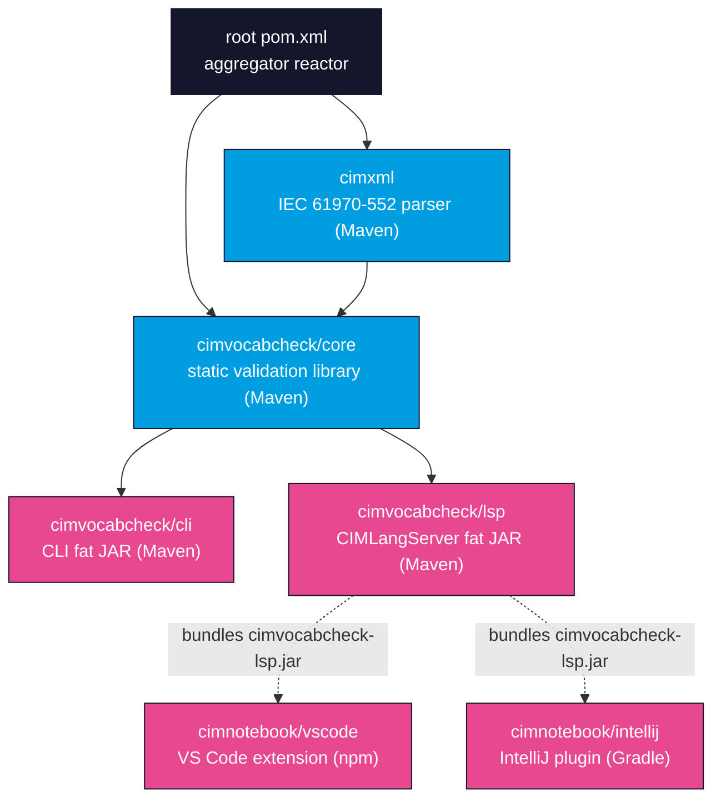

# Repository Overview

OpenCGMES is a single Git repository that ships three independent products — [CIMXML](/cimxml/overview), [CIMVocabCheck](/cimvocabcheck/overview), and [CIMNotebook](/cimnotebook/overview) — built from a mix of Maven, npm, and Gradle modules. This page maps the repository layout and shows how the modules depend on one another, so you know where each piece lives before you start [building](/developer-guide/building).

## The three products

| Product | What it is | Where it lives | Build tool |
| --- | --- | --- | --- |
| **CIMXML** | IEC 61970-552 CIMXML parser library (Apache Jena) | `cimxml/` | Maven |
| **CIMVocabCheck** | Static SPARQL/SHACL validation: library, CLI, and the **CIMLangServer** LSP | `cimvocabcheck/core`, `cimvocabcheck/cli`, `cimvocabcheck/lsp` | Maven |
| **CIMNotebook** | Editor integrations: a VS Code extension and an IntelliJ plugin | `cimnotebook/vscode`, `cimnotebook/intellij` | npm / Gradle |

The products are layered: CIMVocabCheck builds on CIMXML's profile-aware RDF foundation, and CIMNotebook bundles the CIMVocabCheck language server (`cimvocabcheck-lsp.jar`) inside each editor integration.

## Module and dependency graph

The root `pom.xml` is an **aggregator-only reactor**: its `<modules>` are `cimxml` and `cimvocabcheck` (which in turn aggregates `core`, `cli`, and `lsp`). It exists purely so a developer can build everything from the repository root with one command. The child modules deliberately do **not** declare the root as their Maven `<parent>` — each module keeps its own version, dependencies, and release profile, so the per-module release workflows that invoke `mvn -f cimxml/pom.xml ...` keep working unchanged.

:::note CIMNotebook is not in the Maven reactor
The VS Code extension (npm) and IntelliJ plugin (Gradle) are **not** Maven modules, so `mvn install` at the root does not build them. They are built separately and each bundles the LSP fat JAR — see [Building](/developer-guide/building).
:::

## Top-level directory map

| Path | Contains |
| --- | --- |
| `pom.xml` | Aggregator reactor pom (`opencgmes-reactor`); also hosts the CycloneDX/license plugin config used by the SBOM scripts |
| `cimxml/` | CIMXML parser library (Maven module `cimxml`) |
| `cimvocabcheck/` | CIMVocabCheck reactor + shared lint config (`google_checks.xml`, `intellij-java-google-style.xml`, `spotbugs-excludes.xml`) |
| `cimvocabcheck/core/` | Validation library (`cimvocabcheck-core`); the ENTSO-E submodule lives under `core/testing/entsoe/` |
| `cimvocabcheck/cli/` | Command-line tool (`cimvocabcheck-cli`, shaded fat JAR) |
| `cimvocabcheck/lsp/` | CIMLangServer LSP 3.17 server (`cimvocabcheck-lsp`, fat JAR) |
| `cimvocabcheck/sbom/` | Committed Maven SBOM + THIRD-PARTY attribution |
| `cimnotebook/vscode/` | VS Code extension (TypeScript / npm) |
| `cimnotebook/intellij/` | IntelliJ plugin (Kotlin / Gradle) |
| `cimnotebook/sbom/` | Committed VS Code + IntelliJ SBOMs + attribution |
| `scripts/` | Versioning (`compute-version.sh`, `set-versions.sh`) and supply-chain (`generate-sbom.sh`, `check-sbom-licenses.py`) scripts |
| `.github/workflows/` | Six CI/release workflows — one `-ci` and one `-release` per product |
| `docs/` | This Docusaurus documentation site |
| `QueryAndValidationUI/` | Placeholder for the upcoming web application (not yet built) |
| `LICENSE` / `CONTRIBUTING.md` | Apache 2.0 license; contribution guide |

## Where to go next

- [Building](/developer-guide/building) — prerequisites, the submodule, and how to build each artifact.
- [Testing](/developer-guide/testing) — running tests and the ENTSO-E integration suite.
- [CI & releases](/developer-guide/ci-and-releases) — the three independent CI/release trains.
- [Contributing](/developer-guide/contributing) — fork/branch/PR workflow.
