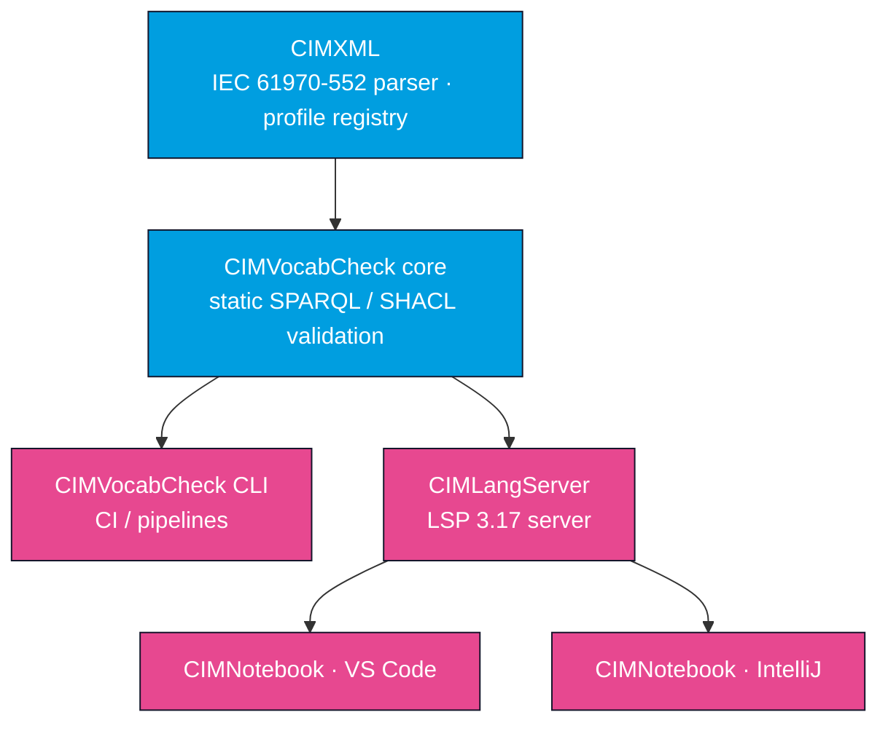

# OpenCGMES

**A suite of open-source tools for working with CGMES / CIM (IEC 61970) RDF** — RDFS profiles,
SHACL constraints, and CIMXML model exchange. Apache 2.0 licensed, built on
[Apache Jena](https://jena.apache.org/).

OpenCGMES is three products that share a common foundation:

- **[CIMXML](/cimxml/overview)** — a Java library that parses IEC 61970-552 CIMXML (full models
  and difference models) into Apache Jena RDF graphs.
- **[CIMVocabCheck](/cimvocabcheck/overview)** — static SPARQL and SHACL validation against
  RDFS / CIM profile schemas. It answers *"does this query or shapes graph make sense for the
  schema I'm working with?"* — **without executing anything and without needing RDF data**.
  Ships as a library, a CLI, and an LSP language server (**CIMLangServer**).
- **[CIMNotebook](/cimnotebook/overview)** — editor integrations (a **VS Code** extension and an
  **IntelliJ** plugin) that bring CIMVocabCheck's validation into the editor as you type.

## How the pieces fit together

CIMXML provides the profile-aware RDF foundation. CIMVocabCheck's core builds a schema index
from CIM/RDFS profiles and validates SPARQL and SHACL against it. The CLI and the
CIMLangServer wrap that core; CIMNotebook fronts the language server inside editors.

## Who should read what

| If you are…                                            | Start with                                            | Then read                                                              |
| ------------------------------------------------------ | ----------------------------------------------------- | ---------------------------------------------------------------------- |
| **Parsing or generating CIMXML** in Java               | [CIMXML overview](/cimxml/overview)                   | [Quick start](/cimxml/quick-start), [Library usage](/cimxml/library-usage) |
| **Writing SPARQL / SHACL** for CGMES profiles          | [CIMVocabCheck overview](/cimvocabcheck/overview)     | [Configuration](/cimvocabcheck/configuration), [Validation checks](/cimvocabcheck/validation-checks) |
| Validating queries/shapes **in Java unit tests**       | [Library & tests](/cimvocabcheck/library-and-tests)   | [API reference](/cimvocabcheck/api)                                    |
| Adding validation **in CI**                            | [CLI](/cimvocabcheck/cli)                             | [Configuration](/cimvocabcheck/configuration), [Endpoints](/cimvocabcheck/endpoints) |
| Working **in an editor** (VS Code / IntelliJ)          | [CIMNotebook overview](/cimnotebook/overview)         | [VS Code](/cimnotebook/vscode), [IntelliJ](/cimnotebook/intellij)     |
| **Contributing** to OpenCGMES                          | [Developer guide](/developer-guide/overview)          | [Building](/developer-guide/building), [Testing](/developer-guide/testing) |
| New to **CIM / CGMES / RDF**                            | [CGMES background](/reference/cgmes-background)        | the product overviews above                                            |

## What you can do with it

- **Parse CIMXML** — read full models and difference models per IEC 61970-552 into Jena graphs,
  with profile-aware datatype resolution and UUID normalization.
- **Catch query and shape mistakes early** — unknown classes/properties, domain/range
  violations, datatype mismatches, and invalid SHACL cardinalities, all **statically**, with no
  dataset and no query execution.
- **Validate in your editor** — squiggly underlines, hover docs, completion, and go-to-definition
  for CIM terms in `.rq`, `.sparql`, `.ttl`, `.shacl`, and SPARQL Notebook cells.
- **Validate in CI** — fail a pipeline on query/shape errors with the CLI, or from your own JUnit
  tests via the library.
- **Load the schema from a SPARQL endpoint** — point at an Apache Jena Fuseki that hosts the CGMES
  profiles and have the schema and per-graph profile scope discovered automatically.

## Coming soon: QueryAndValidationUI

A web application for uploading RDFS schemas, SHACL shapes, and CIMXML files, querying with SPARQL,
and validating against SHACL — currently in development.

## License

OpenCGMES is released under the [Apache License 2.0](https://github.com/SOPTIM/OpenCGMES/blob/main/LICENSE).

## Commercial support

OpenCGMES is actively developed and maintained by **[SOPTIM AG](https://www.soptim.de/)**. The
project is free to use under Apache 2.0; commercial support — maintenance, integration services,
custom extensions, and CIM/CGMES advisory — is available on request. Contact
[opencgmes@soptim.de](mailto:opencgmes@soptim.de).
